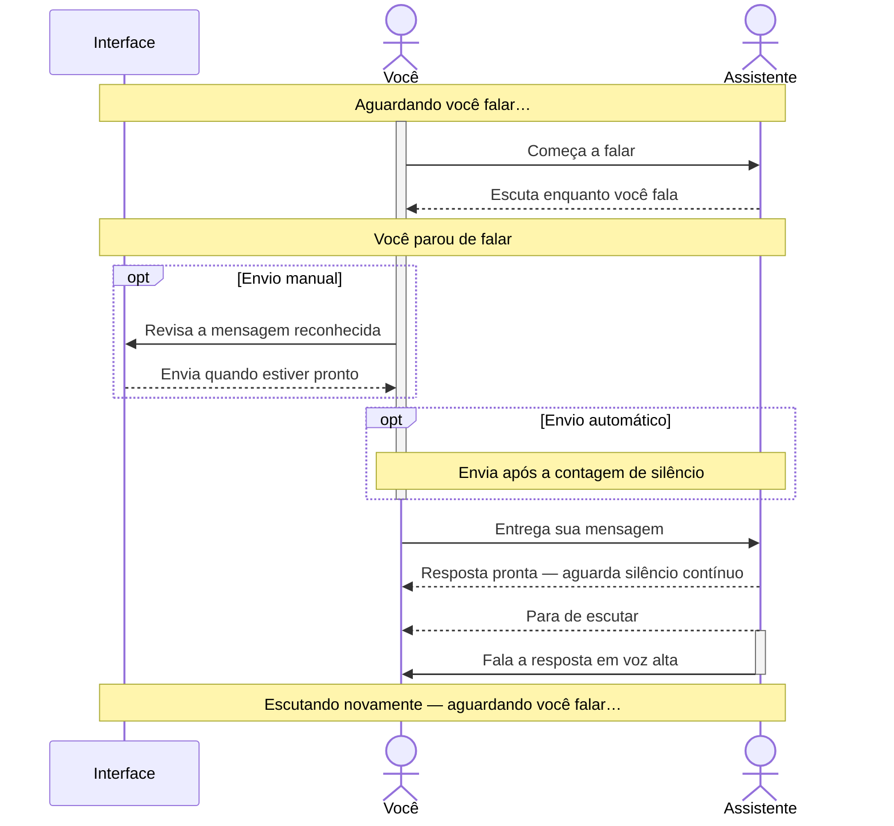

# DSH Live Voice

**Local-first speech recognition, voice output, and continuous voice conversations for DSH.**

DSH Live Voice coordinates the microphone, composer, assistant messages, and speech output in one plugin — without letting listening and speaking compete with each other.

## Why this project exists and Acknowledgments

Listening and speaking should work together, so you can interrupt and be heard without the assistant’s voice getting in the way. [Read the story behind the project](HISTORY.md).

A heartfelt thank you to [GooDAnDReaDY](https://github.com/GooDAnDReaDY) for [dsh-voice](https://github.com/GooDAnDReaDY/dsh-voice) and [Alan2Z](https://github.com/Alan2Z) for [dsh-speak](https://github.com/Alan2Z/dsh-speak). Your projects solved my voice needs in DSH for a while, and I am grateful for the work you shared. Eventually, I reached a point where I needed one codebase to coordinate both listening and speaking. [Read the full story](HISTORY.md).

## Features

| | Capability |
|---|---|
| 🎙️ | Voice typing directly into the DSH composer |
| 💬 | Continuous voice conversations with automatic assistant speech |
| 🧠 | Browser SpeechRecognition or local loopback whisper.cpp |
| 🔊 | Browser speech synthesis or native macOS `say` |
| ⏱️ | Manual or automatic sending after configurable silence |
| 🫁 | Stable-silence delay prevents breathing pauses from starting assistant speech |
| 🎧 | Open-microphone mode for headphones |
| 🔒 | Gated microphone mode for speakers |
| ✋ | Pause, resume, stop, and manual interruption controls |
| 🔈 | Play individual assistant messages on demand |
| 🏠 | Whisper audio reaches the local server only through the authenticated DSH host |

## Conversation flow

The assistant never starts automatic playback while you are speaking. If a response is already waiting — including another assistant message — it waits until you finish and the configured continuous-silence delay has passed.

### Speakers — gated listening (default)

Listening and playback take turns so the assistant does not hear its own voice.

### Headphones — open microphone

The microphone remains open during playback, allowing your voice to pause the assistant.

### Other conversation settings

- **Sending mode:** review and send manually by default, or send automatically after a configurable silence countdown.
- **Assistant response delay:** choose how long you must remain silent before automatic playback starts; speaking again restarts the wait.
- **Automatic assistant speech:** turn automatic playback of new assistant messages on or off.
- **Sent-message interruption:** sending another message does not stop current audio by default, but you can enable that behavior.
- **Manual playback:** play any individual assistant message on demand without waiting for the automatic-playback delay.

## Local-first architecture

- **Recognition:** Browser SpeechRecognition or loopback whisper.cpp HTTP.
- **Speech output:** browser/device audio or native macOS `say`.
- **Whisper transport:** complete WAV utterances through authenticated same-origin DSH routes.
- **Privacy:** raw audio and transcripts are not logged by default.

Speech processing can run locally, but the DSH language model may still be remote.

## License

[GPL-3.0-only](LICENSE). Commercial use and redistribution are allowed subject to the GPL. Third-party speech engines and models may have separate licenses.
