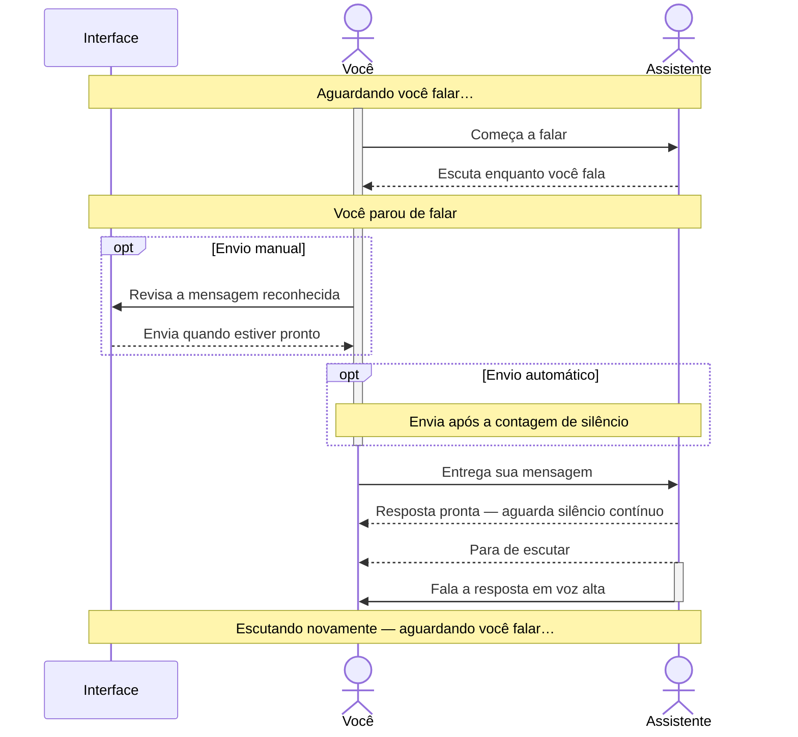

# DSH Live Voice

[](https://www.npmjs.com/package/dsh-live-voice)
[](https://github.com/deepseek-ai/deepseek-harness/releases/tag/v0.1.6-alpha.2)

**A local-first, hands-free voice assistant plugin for DeepSeek Harness (DSH). Speak, listen, answer prompts, and keep working without touching the computer.**

Looking for a DeepSeek Harness voice plugin, DSH microphone plugin, speech-to-text, text-to-speech, or hands-free AI assistant? DSH Live Voice brings those capabilities together in one coordinated plugin.

It coordinates the microphone, composer, assistant messages, structured questions, and speech output without letting listening and speaking compete. Once voice conversation mode is running, DSH can narrate responses and questions, capture your spoken answers, and continue the conversation while your hands stay free.

## Built for daily use, maintained with you

I use DSH Live Voice for at least eight hours a day. For me, it is the best voice plugin for DSH — and I am committed to making it better through real, everyday use.

Have a bug to report, a feature you need, or a pull request to share? [Open an issue](https://github.com/victorwads/dsh-live-voice/issues) or [send a PR](https://github.com/victorwads/dsh-live-voice/pulls). I aim to respond quickly, review contributions promptly, and turn useful suggestions into features. Not every request will be implemented, but I welcome the conversation and will consider what you bring.

## Install

Install the public repository through dsh.pub into your DSH web profile:

```sh
npx dshpub add victorwads/dsh-live-voice --profile web
```

The installer resolves the public repository to an exact commit before adding the bundle. Open **DSH Settings → Live Voice** after the next normal DSH startup.

## Why this project exists and Acknowledgments

Listening and speaking should work together, so you can interrupt and be heard without the assistant’s voice getting in the way. [Read the story behind the project](HISTORY.md).

A heartfelt thank you to [GooDAnDReaDY](https://github.com/GooDAnDReaDY) for [dsh-voice](https://github.com/GooDAnDReaDY/dsh-voice) and [Alan2Z](https://github.com/Alan2Z) for [dsh-speak](https://github.com/Alan2Z/dsh-speak). Your projects solved my voice needs in DSH for a while, and I am grateful for the work you shared. Eventually, I reached a point where I needed one codebase to coordinate both listening and speaking. [Read the full story](HISTORY.md).

## Features

|     | Capability                                                                                                                |
| --- | ------------------------------------------------------------------------------------------------------------------------- |
| 🎙️  | Voice typing directly into the DSH composer                                                                               |
| 👐  | Hands-free conversations: speak, hear responses, and continue without touching the computer                               |
| ❓  | Spoken DSH structured questions with automatic capture and submission of your answer                                      |
| 💬  | Continuous voice conversations that stay active while you navigate between chats                                          |
| 🗣️  | Configurable voice commands for sending, queueing, clearing, muting, resuming, stopping speech, and ending a conversation |
| ⌨️  | Optional hold-Control push-to-talk anywhere on the page while a composer is open                                          |
| 🧠  | Browser SpeechRecognition, local loopback whisper.cpp, or Qwen3-ASR on Apple MLX                                          |
| 🔊  | Browser speech synthesis, native macOS `say`, or Qwen3-TTS on Apple MLX                                                   |
| ⏱️  | Manual or automatic sending after configurable silence                                                                    |
| 🫁  | Stable-silence delay prevents breathing pauses from starting assistant speech                                             |
| 🎧  | Open-microphone mode for headphones                                                                                       |
| 🔒  | Gated microphone mode for speakers                                                                                        |
| ✋  | Pause, resume, stop, and manual interruption controls                                                                     |
| 🔈  | Play individual assistant messages on demand                                                                              |
| 🏠  | Whisper audio reaches the local server only through the authenticated DSH host                                            |

## Hands-free experience

Start voice conversation mode and choose an automatic delivery mode to keep a conversation moving without returning to the keyboard. DSH Live Voice can:

1. Listen for your next message and deliver it after the configured silence period.
2. Read assistant responses aloud as they arrive.
3. Narrate DSH structured questions, listen for your next spoken response, and submit it as a custom answer.
4. Keep voice conversation mode active when you move between chats until you explicitly end it.
5. Accept configurable spoken commands for common conversation controls.
6. Start temporary push-to-talk from anywhere on the page by holding Control, even when the voice bar is off; release to finish queued transcription and automatic delivery, or press Escape to cancel.

The hands-free experience coordinates speech input and output locally when you select local engines. The DSH language model itself may still be remote.

## Conversation flow

The assistant never starts automatic playback while you are speaking. If a response is already waiting — including another assistant message — it waits until you finish and the configured continuous-silence delay has passed.

### Speakers — gated listening (default)

Listening and playback take turns so the assistant does not hear its own voice.



### Headphones — open microphone

The microphone remains open during playback, allowing your voice to pause the assistant.

### Other conversation settings

- **Sending mode:** review and send manually by default, or send automatically after a configurable silence countdown.
- **Assistant response delay:** choose how long you must remain silent before automatic playback starts; speaking again restarts the wait.
- **Automatic assistant speech:** turn automatic playback of new assistant messages on or off.
- **Sent-message interruption:** sending another message does not stop current audio by default, but you can enable that behavior.
- **Manual playback:** play any individual assistant message on demand without waiting for the automatic-playback delay.

## Local-first architecture

- **Recognition:** Browser SpeechRecognition, loopback whisper.cpp HTTP, or Qwen3-ASR through a host-local Apple MLX server.
- **Speech output:** browser/device audio, native macOS `say`, or host-local Qwen3-TTS with WAV playback in the browser.
- **Whisper transport:** complete WAV utterances through authenticated same-origin DSH routes.
- **Privacy:** raw audio and transcripts are not logged by default.

Speech processing can run locally, but the DSH language model may still be remote.

## Qwen3 HTTP engine

When a compatible Qwen3 speech API is already running on the DSH host, choose **Qwen3 ASR — local MLX server** under Speech recognition and **Qwen3 TTS — local MLX server** under Speech output. Configure its base URL in **DSH Settings → Live Voice**. The Qwen server may use any HTTP or HTTPS base URL reachable from the DSH host. The plugin supports the OminiX-API contract and standard OpenAI-style speech endpoints at `GET /health`, `POST /v1/audio/transcriptions`, and `POST /v1/audio/speech`; it does not install, start, stop, or manage that external service or its model weights.

## License

[GPL-3.0-only](LICENSE). Commercial use and redistribution are allowed subject to the GPL. Third-party speech engines and models may have separate licenses.

## Keywords

`dsh`, `dsh-plugin`, `deepseek-harness`, `local-first`, `local-voice`, `hands-free`, `hands-free-ai`, `hands-free-assistant`, `voice-control`, `voice-commands`, `voice-assistant`, `voice-conversation`, `conversational-ai`, `continuous-conversation`, `voice-dictation`, `spoken-prompts`, `speech-to-text`, `text-to-speech`, `speech-recognition`, `speech-synthesis`, `stt`, `tts`, `whisper`, `whisper-cpp`, `qwen3-asr`, `qwen3-tts`, `mlx`, `apple-silicon`, `web-speech-api`, `macos-say`, `turn-taking`, `voice-interruption`, `silence-detection`
