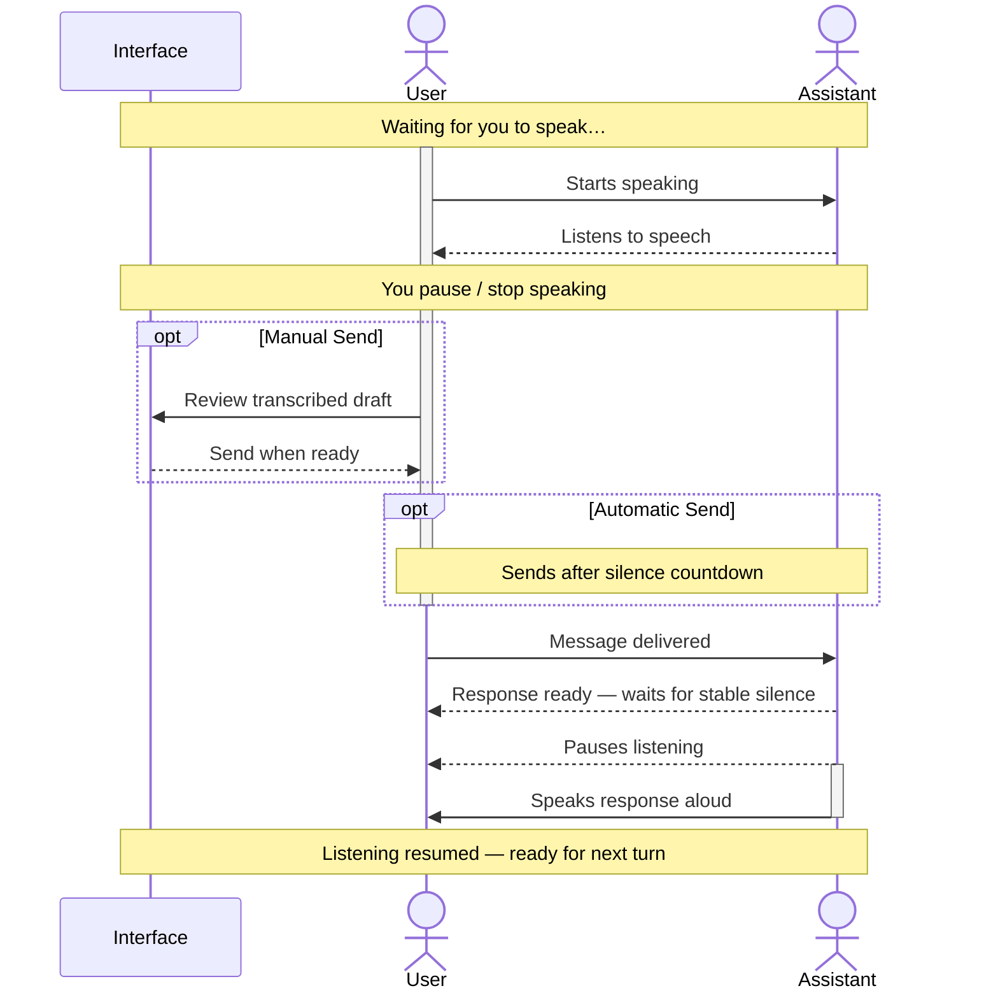

# Configuring DSH Live Voice & Conversation Flow

DSH Live Voice integrates directly into DeepSeek Harness settings under **DSH Settings → Live Voice**.

This guide covers all conversation modes, acoustic settings, silence thresholds, audio device routing, voice commands, and external engine configurations.

---

## 1. Acoustic Modes & Turn-Taking

How listening and speaking coordinate depends on whether you use speakers or headphones:

### Speakers — Gated Listening (Default)
When using speakers, microphone input is automatically gated while the assistant is speaking so the assistant never hears its own voice or transcribes its own output.

- **Interrupting on speakers:** Click **Take microphone** or use the push-to-talk shortcut to take your turn immediately and pause the assistant.

### Headphones — Open Microphone
With headphones, the microphone remains open during playback:
- **Speech-detected pause:** When you begin speaking, the assistant automatically pauses.
- **Debounced interruption:** Requires at least one recognized word to prevent accidental pauses from coughs or background noise.
- **Explicit resumption:** Silence alone does not automatically resume obsolete playback.

---

## 2. Conversation Settings

| Setting | Default | Description |
| --- | --- | --- |
| **Sending Mode** | `Manual` | `Manual` (review before sending), `Automatic` (sends after silence countdown), or `Steer` (send directly to running agent). |
| **Auto-Send Delay** | `4 seconds` | Silence countdown before automatically submitting your draft (configurable from 2 to 10 seconds). |
| **Assistant Response Delay** | `3 seconds` | Continuous silence required after you stop speaking before the assistant begins automatic audio playback. |
| **Automatic Assistant Speech** | `Enabled` | Automatically reads new assistant responses aloud as they stream in. |
| **Stop Speech on Send** | `Disabled` | Immediately stops current assistant playback whenever you submit a new message. |
| **Hold-to-Talk (Push-to-Talk)** | `Enabled` | Hold `Control` anywhere on the page to speak; release to transcribe and auto-send, or press `Escape` to cancel. |
| **Hands-Free Structured Questions** | Automatic | Narrates DSH structured questions, captures your spoken response, and submits it as a custom answer. |

---

## 3. Speech Recognition (Input)

Configure your microphone and speech-to-text (STT) engine:

- **Recognition Engine:**
  - **Browser SpeechRecognition:** Uses the browser/system dictation engine.
  - **Qwen3 ASR — HTTP API:** Connects to a host-local Qwen3 model server.
  - **Whisper — HTTP API:** Connects to a host-local whisper.cpp server.
- **Input Device:** Explicitly select a microphone (USB mic, headset, or built-in).
- **Recognition Language:** Choose **Português (Brasil)**, **English (United States)**, or **Automatic — detect language** (available on Qwen3 and Whisper).
- **Local Processing:**
  - *Process recognition locally on this device:* Ensures speech is not sent to external browser vendor cloud servers.
  - *Automatically install language pack:* Allows the browser to download offline language packs on demand.
- **Silence Detection (VAD) Profiles:**
  - *Short (900 ms):* Fast turnaround for concise commands.
  - *Natural (1500 ms - default):* Balanced for conversational cadence.
  - *Long (2200 ms):* Accommodates thinking pauses during complex prompts.
- **Maximum Utterance Limit:** Split continuous speech after 10 to 300 seconds (default: 60s) to keep transcription chunks manageable.

---

## 4. Speech Output (Speaking)

Configure how assistant messages are read aloud:

- **Speech Engine:**
  - **Browser speech:** Plays audio through the browser device using local system voices.
  - **macOS `say`:** Direct host speech synthesis with zero overhead (plays on the host machine).
  - **Qwen3 TTS:** Neural voice synthesis with WAV streaming playback in the browser.
- **Output Device:** Route playback to specific speakers or headphones.
- **Speech Rate:** Adjust reading speed from 0.1x to 3.0x (1.0 is normal).
- **Code Block Filtering:**
  - Automatically filter out lengthy Markdown code blocks so the assistant doesn't recite syntax line by line.
  - Read code blocks up to a configured line count (e.g. 5 lines).
  - Replace larger code blocks with a custom spoken notice (e.g. *"Look at the code in our conversation"*).

---

## 5. Spoken Voice Commands

When voice commands are enabled, you can speak exact trigger phrases to control the conversation hands-free:

| Action | Default Trigger Phrases |
| --- | --- |
| **Send Message** | `send`, `send message` |
| **Queue Message** | `queue`, `queue message` |
| **End Conversation** | `end`, `end conversation` |
| **Mute Microphone** | `mute`, `stop listening` |
| **Resume Microphone** | `resume`, `start listening` |
| **Stop Speech** | `stop talking`, `stop speaking`, `shut up` |
| **Clear Input** | `clear all`, `clear message` |

*Phrases are configurable in Settings → Live Voice → Commands, supporting comma-separated alternatives.*

---

## 6. External Host Engine Setup

### Qwen3 HTTP Service
When using Qwen3 ASR or TTS:
- Runs as an external local process (e.g. via Apple MLX, OminiX-API, or Python).
- Configured via base URL (default: `http://127.0.0.1:8080/`).
- Exposes standard OpenAI-compatible endpoints:
  - `GET /health`
  - `POST /v1/audio/transcriptions`
  - `POST /v1/audio/speech`
- Credentials and host settings are stored with owner-only permissions in `~/.dsh/dsh-live-voice-qwen.json`.

### Whisper HTTP Service
When using Whisper:
- Connects to `whisper.cpp` server or compatible loopback HTTP daemon.
- Configured via inference endpoint URL (default: `http://127.0.0.1:8080/inference`).
- Audio is validated as bounded 16 kHz mono PCM16 WAV and passed strictly through authenticated same-origin DSH routes.
- Configuration is stored with owner-only permissions in `~/.dsh/dsh-live-voice-whisper.json`.

---

## 7. Privacy & Local Architecture

- **No Remote Telemetry:** Transcripts and raw microphone audio are never logged or phoned home.
- **Strict Loopback:** External engine bridges only accept unauthenticated loopback addresses (`127.0.0.1`, `::1`, `localhost`), preventing external network leakage.
- **Browser vs. Host:** Speech processing runs on your own hardware. Keep in mind that the DeepSeek Harness language model itself may be remote depending on your DSH setup.
